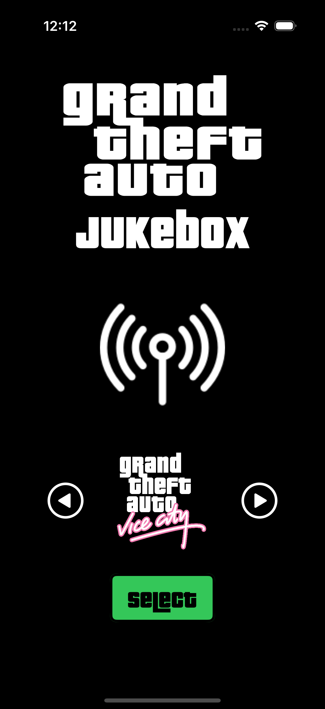

<h1 align="center">

   
GTA Jukebox

</h1>

## Objective
A radio player displaying the various radio channels and songs based on the PS2 GTA series, GTA3, Vice City, San Andreas.

## Progress
- Launch screen created 
- Splash screen created with animation
- Navigation between screens now functional

## Improvements
- Unit Testing

## Testing
- Nil

## Screenshots
  
  

## Demo

## Simulator version
16 Pro
